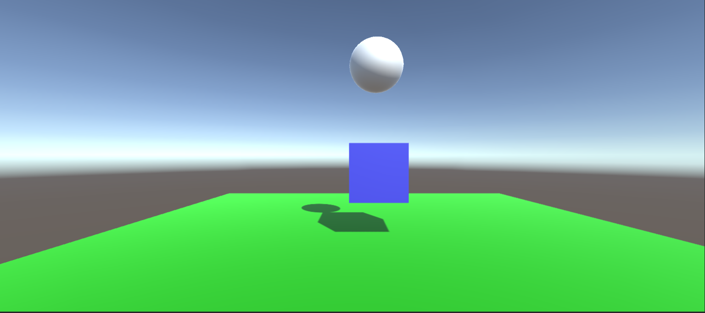
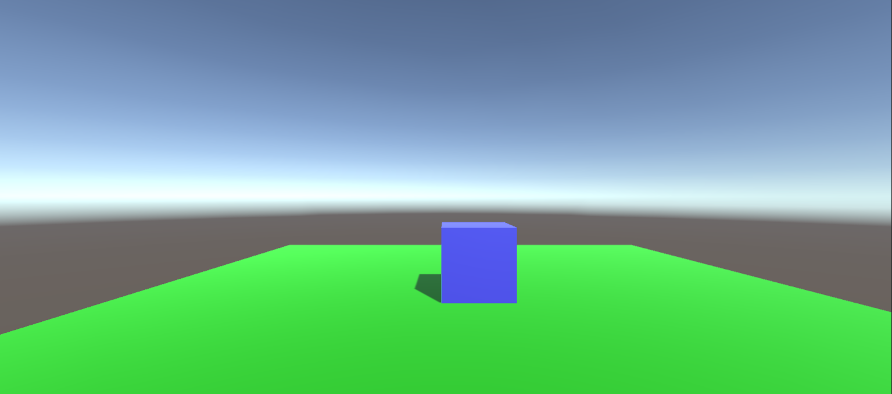
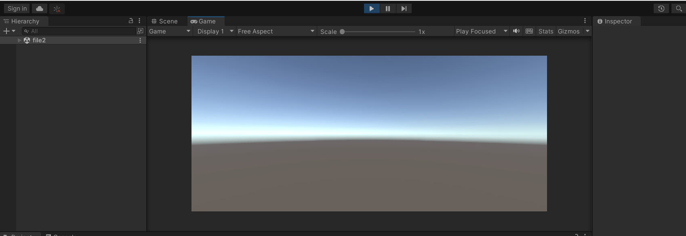

# Redirecting-the-scene

## Aim:
1. Develop a program to identify the object located at a distance using non-contact measurement and make two leds to glow for max and min distance?
https://www.tinkercad.com/things/1ItpOndYOJ5-epic-hango/editel?sharecode=-EYccamFH8894J2QIR8qzGyvCgMixTpWxe7FUvluMYU
2.Calculate the angular movement using analog sensor and display it in a wave form on the serial monitor ?
https://www.tinkercad.com/things/fP8A0bKbm08-ingenious-gogo/editel?sharecode=JDqpQJ2VUs9jJDzofZlEXaw0K1-9u52DLM7TVZ2ogBM
3.Develop a circuit to control  the motor movement in clockwise direction?
 https://www.tinkercad.com/things/1ddNeFtMTGZ-grand-bruticus-elzing/editel?sharecode=WF5LYhw0yi6OojKQ_WHw8XvrvXKKg0K4pJhH1xdxrp4
4.Design a circuit that can rotate any mount in between 0- 180 degrees in clockwise and anticlockwise direction ?
https://www.tinkercad.com/things/1ddNeFtMTGZ-grand-bruticus-elzing/editel?sharecode=WF5LYhw0yi6OojKQ_WHw8XvrvXKKg0K4pJhH1xdxrp4
5.Develop a circuit that can blink 4 leds in sequence of ON – OFF with uniform time delay ?
https://www.tinkercad.com/things/8TCCM4YfItW-powerful-wolt/editel?sharecode=rZmtr0y-VBj2z62CvnaFctMSFw_4k3DsoEuALiTBlXQ
6.Develop a circuit that can measure the total force applied on a surface make a led as an indication if the max force is reached.?
https://www.tinkercad.com/things/ds5u6TmxbY8-fabulous-fyyran-kasi/editel?sharecode=ovl-v5K0PiKcd6_O-a-VtyZ_ytz7dUigtwaLDZaKDaY
7.Design and simulate the led flashing the output if the push button is pressed ?
https://www.tinkercad.com/things/8FoTFeiqdzT-brilliant-waasa/editel?sharecode=hR1WXfLNE1cyKZiTACEi3KHJh84D9Mcfh3terhwaLzI
8.Design and simulate the output if the push button is pressed it flash the leds in non-uniform time delay?
https://www.tinkercad.com/things/lxBfQBCfe3R-spectacular-maimu-bombul/editel?sharecode=HDbP0qJ--wFBmqw4nNjQMBnSmAwBgDnAli94cKueUB4
To Redirecting the scene in the unity engine.


## Algorithm:
## Step 1:
To open the unity engine.

## Step 2:
Create a new plane and create a cube and give color for the cube.

## Step 3:
Next create sphere in the orgin and change the z-axis and Give the color for the sphere.

## Step 4:
Create a tag for the Sphere and Make the sphere and cube as a Rigidbodies and Make the sphere use Gravity.

## Step 5:
Create the C# script file in the Assets and write the Coding for the Redirecting to the page2 after hit the sphere to cube.

## Step 6:
Next Create a another new scene named as page2.

## Step 7
In File->Build settings and drop the both first scene and page2 scene in the Scenes in build setting.

## Step 8:
Click the Build and run button in the Build settings and run the scene.

## Step 9:
The Sphere after touching the cube it will disappeared and Press the key [R] the redircting to the new scene that is page2.

## Program:
```
using System.Collections;
using System.Collections.Generic;
using UnityEngine;
using UnityEngine.SceneManagement;

public class hello : MonoBehaviour
{
    Rigidbody rb;
    // Start is called before the first frame update
    void Start()
    {
        rb = GetComponent<Rigidbody>();
    }

    // Update is called once per frame
    void Update()
    {
        if (Input.GetKeyDown(KeyCode.R))
        {
            SceneManager.LoadScene("lev2");
        }
    }
    private void OnCollisionEnter(Collision collision)
    {
        if (collision.gameObject.tag == "sphere") ;
            Destroy(collision.gameObject);
    }
}

```

## Output:
## Scene 1:

## After the Ball Hit the cube:

## Redirected scene 2:

## Result:
The above C# coding is successfully redirecting the scene in the unity engine.